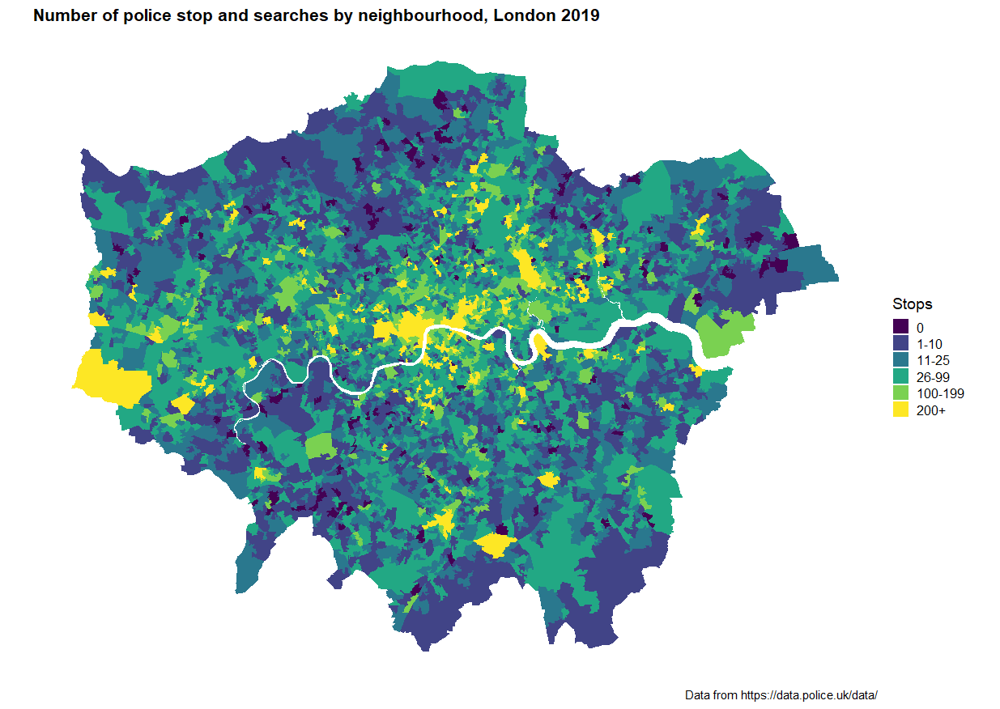

# Economic inequality and police stop and search

This repo contains code and data for reproducing the findings of the paper: [*Economic inequality and the spatial distribution of stop and search: evidence from London*](https://academic.oup.com/bjc/advance-article/doi/10.1093/bjc/azac069/6674351), published in the *British Journal of Criminology* (2021). 

The file `manuscript.Rmd` contains all data for replicating the analysis (as well as text for the paper) -- you can 'knit' this to reproduce the manuscript. All data used is contained in `stop_search_clean.Rdata`.

For an interactive map of stop and search activity in London, see the Stop Watch [App](https://stop-watch.shinyapps.io/StopWatchApp/).

